# 🌟 Tech Portfolio App - Showcase Your Skills in Style

Welcome to the **Tech Portfolio App** repository! This Android application serves as a dynamic and interactive portfolio designed to highlight and showcase your technical skills in a visually appealing and user-friendly manner. Whether you're a developer, designer, or tech enthusiast, this app is tailored to make a strong impression on potential employers, clients, and collaborators.

## 📖 Table of Contents
1. [App Overview](#app_overview)
2. [Features](#features)
3. [Screenshots](#screenshots)
4. [Purpose](#purpose)
5. [How to Use](#how_to_use)
6. [Contribute](#contribute)
7. [License](#license)
---

## App_Overview

### Introduction Page
- Start with a personalized introduction, giving users a brief overview of who you are and what you do.

### Skill Showcase
- Dive into your areas of expertise with **CardViews** representing different technical domains such as:
  - Programming Languages
  - Android App Development
  - Web Development
  - Version Control Systems
  - Artificial Intelligence (AI)
  - Machine Learning (ML)
  - Databases

### Detailed Skill Pages
- Each **CardView** opens a detailed page with images and icons of the technologies you are proficient in, providing a clear and visual representation of your skill set.

### Easy Communication
- Allow potential employers or collaborators to reach out with:
  - **Email Integration**: Pre-configured email intent for quick and easy communication.
  - **Phone Dialer**: Direct dial feature to facilitate immediate contact.

---

## Features
- **Interactive UI**: Clean and modern design with intuitive navigation.
- **Customizable**: Easily update content to reflect your latest skills and projects.
- **Responsive Design**: Compatible across various Android devices and screen sizes.
- **Source Code**: Fully documented codebase to help you understand and extend the app.

---

## Screenshots
Here are some screenshots of the app to give you an idea of its functionality and design:

### Introduction Page
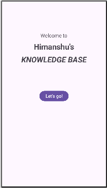

### Skills Overview Page
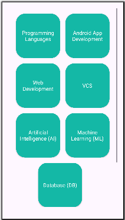

### Detailed Skill Page
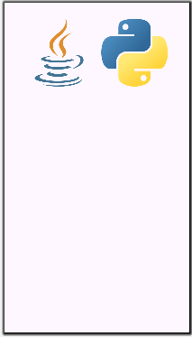
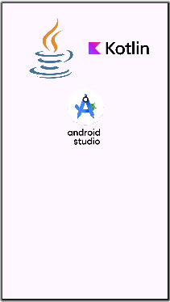
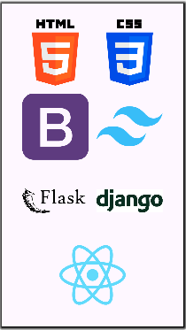
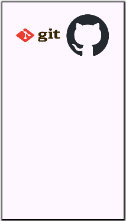
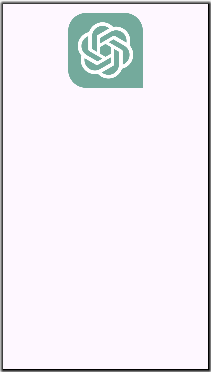
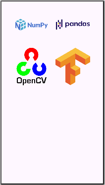
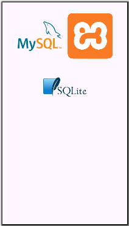

### Communication Buttons
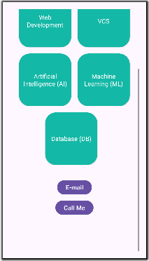

### Communication Buttons - Outputs

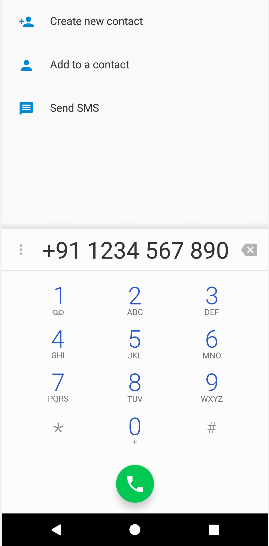

---

## Purpose
This app was built as part of an educational assignment to demonstrate the use of Android development tools, layout management, and implicit intents. It serves not only as a project for learning but also as a practical tool for professional networking and job applications.

---

## How_to_Use
1. **Clone the repository**:

   ```bash
   git clone https://github.com/himanshumaurya0007/Tech_Portfolio_App.git

3. **Open the project in Android Studio.**
4. **Customize the content to reflect your own skills and information.**
5. **Build and run the app on your device or emulator.**
6. **Share your portfolio with the world!**

---

## Contribute
Feel free to fork this repository, contribute enhancements, or suggest new features. Let's collaborate to make this app even better!

1. **Fork the project.**
2. **Create your feature branch.**
   
   ```bash
   git checkout -b feature/AmazingFeature

3. **Commit your changes.**

   ```bash
   git commit -m 'Add some AmazingFeature'
  
4. **Push to the branch.**

   ```bash
   git push origin feature/AmazingFeature
  
5. **Open a Pull Request.**

---

## License
This project is licensed under the MIT License - see the [License](LICENSE) file for details.
